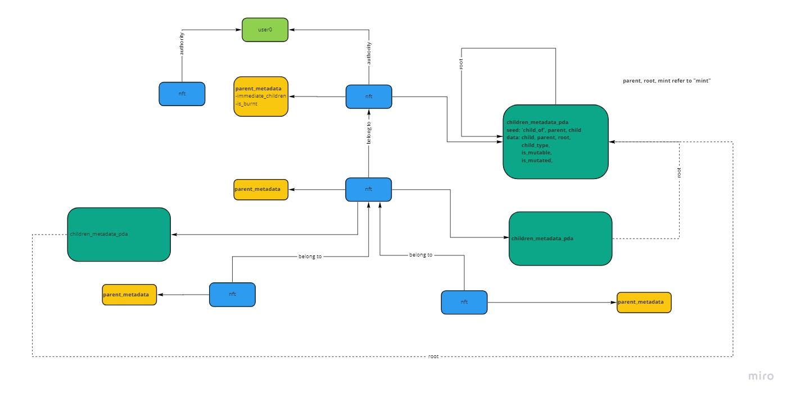

# Enchanft.xyz 💎

Enchanft Protocol is a set a instruction to build Composable NFTs on Solana.

It consists of two features:

- Synthetic NFTs minter ⚡ - responsible for creating synthetic (fake) NFTs using uri from the original + embedding SOL to add intrinsic value. 
- Embed NFTs minter 📦 - responsible for embedding SOL, SPL token, other NFTs into your own NFTs

# Official deployment 🚀

```
nftbxaFtUMxSip8eMTKCPbX9HvjKQmcREG6NyQ23auD
```

You can interact with them using this [enchanft.xyz](https://enchanft.xyz/)

# Docs ✏️




# License 🧾

MIT
